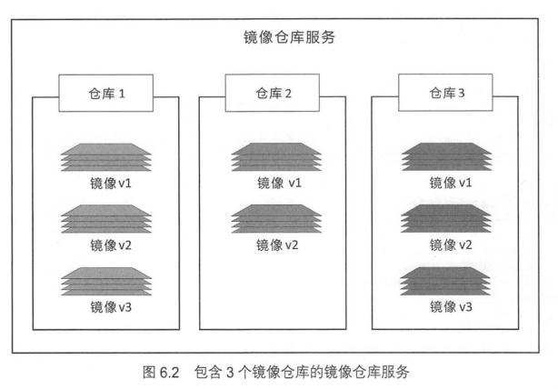
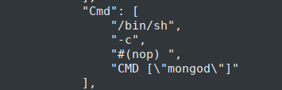

# 《深入浅出Docker》

## 容器发展之路

物理服务器 -> 虚拟机 -> 容器

容器模型与虚拟机模型的区别：

- 容器运行不会独占操作系统，节省系统资源
- 启动快
- 便于迁移

对容器发展影响比较大的技术：

- Kernel Namespace
- Control Group
- Union File System
- Docker

运行中的容器共享宿主机的内核，因此Windows的容器不能跑在Linux上，相反同理。BTW，通常，Docker 跑在 Windows 或 Mac 上都是通过在本地启动一个轻量级的Linux VM来实现的。

Kubernetes 是保证容器部署和运行的软件体系中很重要的一部分，k8s 采用 Docker 作为其默认的容器运行时（container runtime),但是它也提供了一个可拔插的容器运行时接口CRI来帮助 k8s 切换容器运行时。

## 走进 Docker

Docker -> Moby

Docker 公司的核心哲学：“Batteries included but removable"(含电池，但可拆卸)

> 这句话是说 Docker 内置了很多功能或者组件（含电池），但是我们可以很容易的将其切换成其他的有相同接口的组件（可拆卸）。

开放容器计划（The Open Container Initiative, OCI) 是一个旨在对容器基础构架中基础组件（如镜像格式与容器运行时）进行标准化的管理委员会。

## Docker 安装

直接查阅文档即可。

### Docker 存储驱动的选择

每个 Docker 容器都有一个本地的存储空间，用来保存层叠的 Image Layer 和挂载的容器文件系统。默认情况下，容器的读写操作都发生在 Image Layer 或挂载的文件系统中。

本地存储是通过存储驱动（Storage Driver）
进行管理的，不同的存储驱动都实现了 Image Layer 和 Copy on Write，但是实现方式不一样。

在 Linux 上，Docker 可选的存储驱动包括 AUFS、Overlay2、Device Mapper、Btrfs 和 ZFS。

**这里的存储驱动就是在 local 中保存 Docker Container 的文件系统吧？**

可以在`/etc/docker/daemon.json`中设置：

```json
{
	"storage-driver": "overlay2"
}
```

Tips:
- 需要重启 Docker 才能生效
- 修改后，现有的镜像和容器不可用（因为每种存储驱动在主机上存储镜像层的位置不一样）


查看 Docker 当前的存储驱动类型：


当选择 Device Mapper 作为存储驱动时，通过需要合理配置才能表现出良好的性能。

## 纵观 Docker

Play With Docker 是一个基于 Web 界面的 Docker 环境，并且可以免费使用。

Docker 主要包含两个组件：

- Docker Client
- Docker deamon

Docker deamon 实现了 Docker 引擎的 API。**默认情况下，client 和 deamon 通过本地的IPC/UNIX Socket完成**（`/var/run/docker.sock`）

**可以把 Image 类比成 Class**

### Docker 运维

```bash
$ docker image ls # 列出本地镜像
$ docker pull uubuntu:latest # 拉取镜像
```

每一个本地镜像都有一个 Image ID，可以通过这个ID来引用该镜像（通常只需要输入前几个字符即可）


```bash
$ docker container run -it 67fa /bin/bash # -it 表示以交互模式启动，并attach到tty上
```

**在容器中可以用 Ctrl-PQ 来退出容器（同时保持容器继续运行）**

```bash
$ docker container ls # 查看系统内处于运行状态的容器
$ docker ps # 同上
$ docker container ls --all # 查看系统内所有容器，包已经stop的。
$ docker container exec -it <container name or id> bash # 连接到在运行中的容器
$ docker container stop <container name or id> # 停止容器
$ docker container rm <container name or id> # 删除容器
```


**stop和rm的区别？**

### Docker 开发

使用 Dockerfile 来为自己的应用构建 Docker Image

```dockerfile
FROM alpine
LABEL maintainer="wuxiaoabi24@foxmail.com"
RUN apk add --update nodejs nodejs-npm
COPY . /src
WORKDIR /src
RUN npm install
EXPOSE 8080
ENTRYPOINT ["node", "./app.js"]
```

在包含 Dockerfile 的目录下构建 Image：

```bash
$ docker image build -t test:lastest
```

## Docker 引擎

基于 OCI 的要求，Docker 引擎采用了模块化的设计原则，其组件是可替换的。

Docker 引擎主要的组件构成为：

- Docker client
- Docker deamon
- containerd
- runc


Docker 首次发布时，其主要由 LXC 和 Docker daemon 组成。LXC 提供了对 Namespace、CGroup 等基础工具的操作，Docker daemon则包含了 Docker client、Docker API、Container Runtime 和 Image Build等功能。后来，Docker 使用自研的 Libcontainer 代替了 LXC。同时，将原本的 Docker daemon 拆解成许多小而专的工具。

目前的 Docker 的构架图：


官方文档给出的构架图：


Docker 用 runc 来实现所有容器运行代码运行在一个单独的 OCI 兼容层。同时 runc 是 OCI 容器运行时标准的参考实现。runc 生来只有一个作用——创建容器。runc 实质上是一个轻量级的、针对 Libcontainer 进行了包装的命令行交互工具。

containerd 包含了所有容器执行逻辑，其主要任务是容器的生命周期管理——`start|stop|pause|rm...`，同时，它还有一些其他的功能，如镜像管理。Docker 中 containerd 组件确保了 Docker 镜像能够以正确的 OCI Bundle 的格式传递给 runc。

启动一个容器的过程：

```bash
$ docker container run --name ctrl -it alpine:lastest sh
```

1. Docker cli 将命令转换为合适的 API 格式（REST API），发送给 Docker daemon
2. Docker daemon 接收到命令后，向 containerd 发出调用（CRUD 风格，gPRC）
3. containerd 将 Docker 镜像转换为 OCI bundle，并让 runc 基于此创建一个新的容器。
4. runc 与 kernel 进行通信，并基于 Namespace、CGroup等工具来创建容器。
5. 容器进程作为 runc 的子进程启动，启动完毕后，runc 将会退出。


由于用于启动、管理容器的逻辑和代码都从 daemon 中移除了，即 Docker Runtime 和 Docker daemon 是解耦的，所以对 daemon 的维护和升级不会影响到运行中的容器。（deamonless container)

在上图中，还有一个 shim 组件。每次创建容器都会 fork 一个新的 runc 实例，并在容器创建完成后退出。在 runc 退出后，与它相关联的 shim 进程就会成为容器的父进程，其部分职责如下：

- 保持所有 STDIN 和 STDOUT 流是开启状态，从而当 daemon 重启时，容器不会因为 pipe 的关闭而终止。
- 将容器的退出状态反馈给 daemon

daemon 现在的主要功能包括：

- 镜像管理
- 镜像构建
- REST API
- 身份验证
- 安全
- 核心网络
- 编排

## Docker 镜像

可以把 Docker Image 理解成 Class。

镜像由多个层组成，每层叠加后，从外部看起来如一个独立的对象。

镜像就像停止运行的容器（类）。我们可以停止某个容器的运行，并从中创建新的镜像。因此，我们可以把镜像理解成一种构建时的结构，而容器则是一种运行时的结构。


一旦容器从镜像启动后，在容器全部停止前，镜像是无法被删除的。

镜像通常比较小，其在构建时就被裁剪掉不必要的部分。通常 Docker 镜像中只包含一个精简的 Shell，甚至没有 Shell。**镜像中不包含内核——容器都是共享所在 Docker 主机的内核**

Linux Docker Local Image 存储在 `/var/lib/docker/<stroage-diver>`


Docker 镜像存储在镜像仓库服务（Image Registry） 中，默认使用 Docker Hub。一个镜像仓库服务包含多个镜像仓库（Image Repository）。




通过镜像的名字和标签来在仓库中定位一个镜像：

```bash
$ docker image pull <repository>:<tag> # 加上 -a 表示拉取所有标签
```

- 如果没有指定标签，则默认为 lastest
- lastest 不保证这是仓库中最新的镜像。
- 从非官方仓库中拉取镜像需要在仓库名称加上 Docker Hub的用户名或组织名，如`docker image pull nigelpoulton/tu-demo:v2`
- 如果希望在第三方镜像仓库服务获取镜像，则需要在仓库名称前面加上第三方镜像仓库服务的 DNS 名称，如`docker image pull grc.io/nigelpoulton/tu-demo:v2`

**悬虚镜像**：没有标签的镜像，`<none>:<none>`。通常是因为构建了一个新的镜像并为该镜像打了一个已经存在的标签。这时候旧镜像就会变成悬虚镜像。可以使用`docker image prune`移除所有悬虚镜像。

可以使用`--filter`来过滤`docker image ls`返回的镜像列表内容，支持的过滤器如下：

- dangling：`true/false`，是否为悬虚镜像。
- before:`<image name or id`，返回在其之前被创建的全部镜像
- since:`<image name or id`，返回在其之后被创建的全部镜像
- label:标注（label）的名称或值。标注在Dockerfile通过 LABEL 指定，但是`docker image ls`不显示。
- `reference`:用正则表达式对镜像名称和标签过滤

```bash
$ docker image ls --filter dangling=true
$ docker image ls -f before=alpine # -f 是 --filter 的简写
$ docker image ls -f reference="*:latest"
```

通过`--format`参数可以对输出内容进行格式化输出。如果只想输出`IMAGE ID`的话，可以用`-q`，这个在批量删除的时候很有用：

```bash
$ docker image ls --format "{{.Size}}" # 只输出 SIZE
$ docker image ls -q # 只输出 IMAGE ID
```

使用`docker search`可以对 Docker Hub 进行搜索，同样在搜索的时候可以使用过滤器:

- is-official：true/false，是否为官方镜像
- is-automated:true/false，是否为自动创建的镜像

`docker search`默认返回25行结果，可以通过`--limit`来指定个数。

```bash
$ docker search alpine
```

Docker 镜像由一些松耦合的只读层组成：


在`docker image pull`的时候会显示出来有什么层，同时可以用`docker image inspect golang:1.13`的方式显示出来：


所有的 Docker 镜像都起始于一个基础镜像成，当进行修改或新增加内容的时候，就会在当前镜像层上创建新的镜像层。


Docker 通过存储引擎（或快照机制）来实现镜像层堆栈，并保证多镜像层对外展示为统一的文件系统。即：


**多个镜像间会共享镜像层**，这样有效的节省了存储空间，并提升性能。

> 看起来，每一个镜像层都使用哈希作为一个ID，然后用这个ID来区分不同的镜像层，所以在不同镜像中的ID相同的镜像层会被视为同一个镜像层，因此就可以共享了。

除了使用标签来拉取镜像外，我们还可以使用镜像摘要（Image Digest)来拉取镜像。使用它的原因是因为，标签是可以重复打的，所以可能会出现 Local 和 Docker Hub 中相同标签的 Image 的内容是不一样的。所以 Image 的唯一性标识其实是通过镜像摘要实现的。

所谓的 Image Digest，就是对镜像的镜像层进行一次哈希，而得一个 Hash 值，然后用这个 Hash 作为 Image Digest 来定位 Image。这个还可以用来校验在传输过程中，镜像内容时候被更改（BTW，在传输时，镜像层内容会被压缩，所以还有一个 Distribution Hash 来校验压缩版本的镜像）

Docker 通过多架构镜像（Multi-architecture Image）解决了一个镜像支持多个平台和架构。它主要是用过 Manifest 列表实现的。Manifest 列表是某个镜像标签支持的架构列表，其支持的每个架构都含有自己的 Manifest。Docker 会自动选择对应的版本，所以 Docker 的使用与正常情况并无差别。**Manifest 列表是可选的，所以不是所有镜像都支持多个平台**。


使用`docker image rm`可以删除镜像，镜像层只有在没有其余镜像含有它的时候才会被删除。如果该镜像存在正在运行的容器，那么删除操作不会被允许。

```bash
$ docker image rm 0267 # 通过镜像ID来删除 docker 镜像
$ docker image rm $(docker image ls -q) # 删除所有镜像
$ docker image rm -f 0267 # -f mean --force
```

## Docker 容器

容器是镜像的运行时实例。


```bash
$ docker container run <image> <app> # 基础格式
$ docker container run -it <image> <app> # -it 表示启动一个交互性程序，并将当前终端连接到容器的Shell终端上
$ docker container run -d <image> <app> # -d 表示以后台的方式启动容器
$ docker container run -d --name <container-name> <image> <app> # --name 给容器命名
$ docker container run -d -p <host-port>:<container-port> <image> # -p 配置端口转发，不指定 <app>的话会运行默认应用
$ docker container ls # 显示运行中的容器
$ docker container ls -a # 显示所有容器（包括 stopped）
$ docker container ls -q # 显示运行中容器的 id
$ docker container stop <container id or name> # 手动停止容器运行
$ docker container start <container id or name> # 再次启动该容器
$ docker container rm <container id or name> # 删除容器
$ docker container rm $(docker container ls -aq) -f # 快速删除所有容器
```

### 虚拟机与容器：

- 容器与虚拟机都依赖于宿主机运行
- 虚拟机是硬件虚拟化，将硬件物理资源划分为虚拟资源
- 容器是操作系统虚拟化，将系统资源划分为虚拟资源
- 每个虚拟机都需要自己的操作系统，因此会带来额外的 OS Tax 或者 VM Tax，而容器共享一个操作系统/内核，同时因为容器不是完整的操作系统，所以启动远比与虚拟机快。


```bash
$ usermod -aG docker <user> # 将用户加入到本地 Docker 组里面（需要退出并重新登陆 Shell
```

在 Linux 中，Docker deamon 通过位于 `/var/run/docker.sock` 的本地IPC/Unix sock 来实现 Docker 远程API。

```bash
$ docker container run ubuntu:latest /bin/bash -it
```

上面的命令启动的了一个 Ubuntu 容器，并让容器运行 Bash Shell，这时**Bash Shell 是容器中唯一运行的进程**。这意味着，如果通过`exit`退出 Shell 的话，容器也会退出。这是因为杀死容器中的主进程，容器也会被杀死。

- 使用`Ctrl-PQ`可以退出容器，但是不终止容器的运行。
- `docker container attach <image id or name>`可以`attach`到对应进程的`shell`中。
- `docker container exec <image id or name> <command>` 可以让容器执行相应的命令。

开启一个容器，并用`cd tmp`打开`tmp`文件夹，然后`Ctrl-PQ`退出容器：


使用`docker container exec`开启一个新的`bash`，然后同样用`Ctrl-PQ`退出：


现在容器中有两个 Bash 在运行，第一个 Bash 的当前目录是`/tmp`，而另一个的当前目录是`/`，使用`docker container attach`会让我们`attach`到第一个 Bash 中，这时使用`exit`退出，我们会发现整个容器都退出了（第一个 Bash 是主进程）：


- `docker run` 创建容器
- `docker stop` 停止运行
- `docker start` 重新启动容器
- `docker rm` 销毁容器
- 停止容器运行并不会损坏容器或者其中的数据

`docker container stop` 向容器中PID 1进程发送 `SIGTERM` 这样的信号，这样会为进程预留一个清理并优雅停止的机会，如果 10s 内进程没有终止，那么就会收到 `SIGKILL` 信号，而`docker conatiner rm <conatienr> -f` 则是直接发出`SIGKILL`。

容器的重启策略：

- `always`：除非容器明确被停止（如`docker container stop`）,否则该策略会一直尝试重启该容器；docker deamon 重启时，其实是 stopped 的容器也会被重启。
- `unless-stopped`：除非容器明确被停止（如`docker container stop`）,否则该策略会一直尝试重启该容器；但是在 docker deamon 重启时，stoppped 的容器**不会**被重启。
- `on-failure`：会在退出容器并返回值不是 0 的时候，重启容器。在 Docker deamon 重启时，即使处于 stopped 状态，也会重启。

```bash
$ docker image inspect <image> # 显示关于 Image 的信息，可以用来看默认运行的应用
```




## 应用的容器化

Docker 的核心思想就是如何将应用整合到容器中，并且能在容器中实际运行。将应用整合到容器中并运行起来的过程称为“容器化”或者“Docker 化”。

应用容器化过程：

1. 编写应用程序
2. 创建一个 Dockerfile，其中包括当前应用的描述、依赖以及该如何运行这个应用。
3. 对该 Dockerfile 执行 `docker image build` 命令
4. 等待 Dockerfile 将应用程序构建到 Docker 镜像中。


Dockerfile 例子：

```dockerfile
# Test web-app to use with Pluralsight courses and Docker Deep Dive book
# Linux x64
FROM alpine

LABEL maintainer="nigelpoulton@hotmail.com"

# setup APK mirrors
RUN sed -i 's!http://dl-cdn.alpinelinux.org/!https://mirrors.ustc.edu.cn/!g' /etc/apk/repositories
# Install Node and NPM
RUN apk add --update nodejs nodejs-npm

# Copy app to /src
COPY . /src

WORKDIR /src

# Install dependencies
RUN  npm install  --registry=https://registry.npm.taobao.org

EXPOSE 8080

ENTRYPOINT ["node", "./app.js"]
```

Dockerfile 的主要用途：

- 对当前应用的描述
- 指导 Docker 完成容器化（创建镜像）

指令：

- `FROM`指令：指定镜像，该镜像会作为当前镜像的一个基础镜像层，当前应用的剩余内容会作为新增镜像层添加到基础镜像层之上。
- `LABEL`指令：增加一个标签（包含在元数据中，本质上是一个键值对），可以用来指定作者等。
- `RUN`指令：执行命令，会生成新的镜像层。
- `COPY`指令：拷贝文件到当前镜像，会生成新的镜像层。
- `WORKDIR`指令：设置工作目录（该信息添加到元数据中）
- `EXPOSE`指令：暴露端口（该信息添加到元数据中)
- `ENTRYPOINT`指令：设置入口程序（该信息添加到元数据中）

区分命令是否会新建镜像层的基本原则：如果指令会向镜像中添加新的文件或者程序，那么这条指令就会新建镜像层。

由于每个RUN指令都会新增一个镜像层，所以通常使用`&&`和`\`来将多个命令写到一个RUN指令中：

```dockerfile
RUN cd src \
	&& npm build
```

构建镜像:

```bash
# Dockerfile 在当前目录 -t 表示设置镜像
$ docker image build -t web:latest .
```

给镜像重新设置标签：

```bash
$ docker image tag web:1.0 wuxiaobai24/web:latest
```

Docker镜像的基本构建过程：

- 运行一个临时容器
- 在临时容器中运行指令
- 将指令的运行结果保存成一个新的镜像层
- 删除临时容器

多阶段构建方式：

在一个 Dockerfile 中包含多个 FROM 指令，每个 FROM 指令会创建一个临时容器，相当于一个构建阶段，这样我们可以在一个构建阶段中对源码进行编译，然后在另一个构建阶段中将编译好的程序拷贝到当前镜像，这样编译过程中的中间结果就不会留在最终的镜像中了。

拷贝使用`COPY --form compile:1.0 /usr/src/app/a.out .`的形式。

我们只需要对一个 Dockerfile 执行 `docker image build`命令即可。

一些最佳实践：

- 利用缓存：
	- 在使用 Dockerfile 对镜像进行构建时，它每执行一条指令都会判断当前机器中是否已经有缓存了，如果有就可以直接跳过，没有的话就需要执行命令或者拉取镜像
	- 只要有一条指令不命中，那么后面整个构建都不再使用缓存，因此尽量将易于发生变化的指令放在后面。
	- 如果使用`COPY`类似的指令会检查复制到镜像中的内容与上次是否相同。
- 合并镜像：
	- 一般在创建基础镜像时会使用，将多个镜像层压成一层
	- `docker image build --squash`即可
- 使用`apt`时，`apt-get install <app> --no-install--recommends`

## 使用 Docker Compose 部署应用

使用 Docker Compose 可以以单引擎对多容器应用进行部署和管理。

大部分应用通过多个更小的服务相互协同来组成一个完整可用的应用。

Docker Compose 通过一个声明式的配置文件描述整个应哟，从而使用一条命令来完成部署。

- 编写定义多容器应用的 YAML 文件
- 将其交由 docker-compose 来处理
- docker-compose 会基于 Docker 引擎 API 完成应用的部署

Docker Compose 默认使用文件名为`docker-compose.yml`或者`docker-compose.yaml`，可以使用`-f`参数来指定配置文件。

```yaml
version: "3.5"
services:
  web-fe:
    build: .
    command: python app.py
    ports:
      - target: 5000
        published: 5000
    networks:
      - counter-net
    volumes:
      - type: volume
        source: counter-vol
        target: /code
  redis:
    image: "redis:alpine"
    networks:
      counter-net:

networks:
  counter-net:

volumes:
  counter-vol:
```

解释：

- `version`：指定 Compose 文件格式，建议使用最新版本
- `network`：指导 Docker 创建网络，默认情况下，会创建`bridge`网络。
- `volumes`: 指导 Docker 创建卷
- `services`: 定义不同的应用服务：
	- `build`:指定Dockerfile所在文件夹
	- `command`：要运行的指令
	- `ports`:端口映射
	- `networks`:指定使用的网络
	- `volumes`:指定使用的卷，及其映射
	- `images`:指定使用的镜像

docker-compose 命令：

```bash
# 启动应用，当前文件夹必须有 docker-compose.yml 或者 docker-compose.yaml 文件
# -d 表示后台运行
# -f 指定配置文件
$ docker-compose up -d
```


