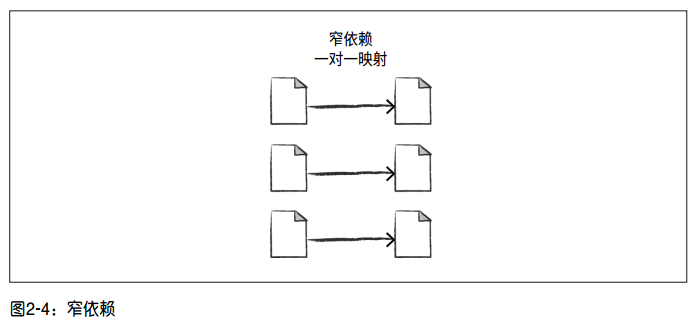

# Spark 权威指南

[toc]

## 大数据与 Spark 概述

### Spark 是什么？

Apache Spark是一个在集群上运行的**统一计算引擎**以及一组并行数据处理**软件库**。


Spark 的设计哲学：

- 统一平台：Spark 的主要目标是为编写大数据应用程序提供统一的平台
- 计算引擎：Spark 也专注于计算引擎，支持多种存储系统
- 配套的软件库：Spark 不仅随计算引擎提供标准库，同时也支持一系列由开源社区发布为第三方包的外部库。

### Spark 浅析

Spark 是一种管理和协调多台计算机的计算任务的软件框架，它让我们使用想使用一台计算机一样使用多台计算机（集群）的计算资源。这些用来执行计算任务的计算机由集群管理器管理，如Spark的集群管理器、YARN或Mesos。当我们提交Spark应用程序给这些集群管理器时，它们将计算资源分配给应用程序。

Spark 应用程序由一个驱动器进程和一组执行器进程组成：

- 驱动进程运行 main() 函数
  - 它负责的三件事情：
    - 维护 Spark 应用程序的相关信息
    - 回应用户的程序或输入
    - 分析任务并分发给若干执行器进行处理
  - 它在应用程序执行的整个生命周期维护所有相关信息。
- 执行器负责执行驱动器分配给它的计算任务
  - 它负责的两件事：
    - 执行由驱动器分配给它的代码
    - 将执行器的计算状态报告给驱动器


Spark 支持多种语言：Scala、Python、Java、SQL，R。不同的语言可以通过 SparkSession 的驱动器来控制Spark应用程序，Spark会将其翻译成驱动器执行的代码。

Spark 有两套基本 API：低级的非结构化 API 和更高级别的结构化API。

DataFrame 是最常见的结构化 API，可以将其当成包含列和行的数据表，这些列和列类型的一些规则被称为模式（Scheme），它与Pandas中DataFrame最根本区别就是Spark DataFrame 会被分成多个分区（多行组成一个分区）存储在多个计算机中。我们不需要手动操作分区，只需要在DataFrame中指定转换操作即可，Spark会自动转译成对多个分区的操作。

转换操作可以分成两种：

- 具有窄依赖关系的转换操作（窄转换）是每个输入分区对应一个输出分区。



- 具有宽依赖关系的转换（宽转换）是每个输入分区绝对了多个输出分区（输出分区不一定要比输入分区多）。这种宽转换通常被称为洗牌操作（shuffle），它会在整个集群中执行相互交换分区数据的功能。


**转换操作并没有实际输出，它们可以认为是一种声明式API，只是定义了操作，并没有真正的执行**，即 Spark 的**惰性评估**，只有在需要的时候才执行计算。在 Spark 中，当我们需要运行一个动作操作（action）时，就会触发计算。一个动作操作在Spark中表示一系列转换操作后计算一个结果。有三类动作：

- 在控制台中查看数据的动作
- 在某个语言中将数据汇聚为原生对象的动作
- 写入输出数据源的动作

可以通过 Spark 的Web UI监控一个作业的进度。

Spark 读取CSV时支持模式推理，它会读取前几行CSV，然后推到其在Spark中的类型，**读取操作也是一个转换操作，不会立即执行**。

虽然我们不能操作物理数据，但是我们可以通过配置参数来指定物理执行的特性，如设置 shuffle 分区。

使用Spark SQL，你可以将任何DataFrame注册为数据表或视图（临时表），并使用纯SQL对它进行查询。编写SQL查询或编写DataFrame代码并不会造成性能差异，它们都会被“编译”成相同的底层执行计划。

我们可以通过`expalin`函数来查看 Spark 创建的执行计划。由于Spark会对执行计划进行优化，所以真正的执行计划可能会和我们定义的操作不相同。

### Spark 工具集介绍

Spark 除了提供了低级 API 和结构化 API，还提供了一系列标准库来提供额外的功能：


#### spark-submit

使用`spark-submit`向集群发送应用程序代码：

```bash
$ spark-submit \
	--class org.apache.spark.examples.SparkPi \
	--master local \
	./examples/jars/spark-examples_2.11-2.4.0.jar 10
```

其中`10`为程序的参数

#### Dataset

Spark 提供了类型安全版本的结构化API——Dataset：

- Dataset 只适用于 Scala 和 Java（因为 Python 和 R 是动态类型的语言）
- Dataset API 让用户可以用 Java 或 Scala 类定义 DataFrame 中的每条记录，并将其作为类型对象的集合来操作
- 其支持的类型遵循 Java 中的 JavaBean 模式或者 Scala 中的 case 类。

```scala
case class Flight(DEST_COUNTRY_NAME: String, ORIGIN_COUNTRY_NAME: String, count: BigInt)
val flights = flightsDF.as[Flight]
```

#### 结构化流处理

结构化流处理是用于流处理的API，它让我们可以在批处理模式下一样使用 Spark 的结构化 API 执行结构化流处理，并以流式方式运行，使用结构化流处理可以减少延迟并运行增量处理。

```scala
import org.apache.spark.sql.functions.{window, column, desc, col}

// 流式读
val streamingDataFrame = spark.readStream
	.schema(staticSchema)
	.option("maxFilesPerTrigger", "1")
	.format("csv")
	.option("header", "true")
	.load("/data/retail-data/by-day/*.csv")
// 定义转换
val purchaseByCustomerPerHour = streamingDataFrame.selectExpr(
    "CustomerId",
    "(UnitPrice * Quantity) as total_cost",
    "InvoiceDate"
	).groupBy(
    	$"CustomerId", window($"InvoiceDate", "1 day")
	).sum("total_cost")
// 流式写表中
purchaseByCustomerPerHour.writeStream
	.format("memory")
	.queryName("customer_purchases")
	.outputMode("complete").start()
// 查询结果
spark.sql("""
SELECT *
FROM customer_purchases
ORDER BY `sum(total_cost)` DESC
""").show(5)
```

#### 机器学习

Spark 使用 `MLlib` 来支持大规模机器学习：

```scala
import org.apache.spark.sql.functions.date_format

// 处理缺失值和转换Date
val preppedDataFrame = staticDataFrame.na.fill(0)
	.withColumn(
    	"day_of_week",
    	date_format($"InvoiceDate", "EEEE")
	).coalesce(5)

// 划分训练集和测试集
val trainDataFrame = preppedDataFrame.where("InvoiceDate < '2011-07-01'")
val testDataFrame = preppedDataFrame.where("InvoiceDate >= '2011-07-01'")

// 定义转换 Pipeline 并将其运用到训练集中
import org.apache.spark.ml.feature.{StringIndexer, OneHotEncoder,VectorAssembler}
import org.apache.spark.ml.Pipeline

val indexer = new StringIndexer()
	.setInputCol("day_of_week")
	.setOutputCol("day_of_week_index")
val encoder = new OneHotEncoder()
	.setInputCol("day_of_week_index")
	.setOutputCol("day_of_week_encoded")
val vectorAssembler = new VectorAssembler()
	.setInputCols(Array("UnitPrice", "Quantity", "day_of_week_encoded"))
	.setOutputCol("features")
val trainsformationPipeline = new Pipeline().setStages(Array(indexer, encoder, vectorAssembler))

val filttedPipeline = trainsformationPipeline.fit(trainDataFrame)
val transformedTraining = filttedPipeline.transform(trainDataFrame)
transfomedTraining.cache()

# KMeans 聚类
import org.apache.spark.ml.clustering.KMeans

val kmeans = new KMeans().setK(20).setSeed(1L)
val kmModel = kmeans.fit(transformedTraining)
val cost = kmModel.computeCost(transformedTraining)
```

#### 低级 API

Spark 包含了许多低级原语来支持弹性分布式数据集（RDD）对任意的 Java 对象进行操作，Spark 所有对象都建立在 RDD 中。RDD 可以在 Scala 和 Python 中使用，但是它们并不等价。

## 结构化 API——DataFrame、SQL 和 Dataset

### 结构化 API 概述

结构化 API 是处理各种数据类型的工具，可以处理非结构化的日志文件、半结构话的 CSV 文件以及高度结构化的 Parquet 文件，其包含三种核心分布式集合类型的 API ：

- Dataset 类型
- DataFrame 类型
- SQL 表和视图

DataFrame 和 Dataset 是具有行和列的类似与（分布式）数据表的集合类型，由于 SQL 表和视图与 DataFrame 基本相同，所以下面内容不提及 SQL 表和视图。

DataFrame 和 Dataset 的区别在于，DataFrame 是非类型化的 API，而 Dataset 是类型化的 API。这里说的非类型化是指 DataFrame 的类型是由 Spark 在运行时检查的，而 Dataset 在编译时就检查类型，因此 Dataset 只适用于基于  JVM 的语言。

在 Scala 中，DataFrame 就是一些 Row 类型的 Dataset 的集合，Row 类型避免了垃圾回收的开销，有利于高效计算。

Spark 在计划订制和执行作业中使用 Catalyst 引擎来维护类型信息，由于 Spark 会将输入语言编写的表达式转换为相同功能的 Spark 内部 Catalyst 表示，所以不论使用哪种 API 都能达到足够的高效。

Scheme 定义了 DataFrame 的列名和类型，可以手动定义或从数据中读取模式：

- 列表示一个简单类型，或者一个复杂类型，或者空值 null。
- 行对应一个数据记录

Spark 的内部类型与 Scala 类型的对应表：


结构化 API 执行：

- 编写 DataFrame / Dataset / SQL 代码
- Spark 将其转换为一个逻辑执行计划
  - 逻辑计划仅仅代表一组抽象转换，并不涉及执行器或驱动器，它只是将用户的表达式集合转换为最优版本
  - Catalyst 优化器尝试通过下推谓词或选择操作来优化逻辑计划。
- Spark 将逻辑执行计划转换为一个物理执行计划，并对其进行优化
  - 物理计划通过生成不同的物理执行策略，并通过代价模型进行比较分析，选择适合的物理执行计划（如何在集群中执行逻辑计划）
- Spark 在集群上执行该物理执行计划（RDD操作）

### 基本的结构化操作

DataFrame 有记录（record）组成，record 是 Row 类型，一条 record 由多列组成，列表示可以在该 DataFrame 中每个单独的记录上执行计算表达式。

DataFrame 的分区定义了 DataFrame 以及 Dataset 在集群上物理分布，而划分模式定义 partition 的分配方式。

模式定义了 DataFrame 列的名和数据类型，它可以通过数据源来定义模式，也可以显式定义。建议自己定义，因为通过数据源来定义模式可能会导致精度损失。

一个模式是由许多字段组成的`StructType`，这些字段即为`StructField`，具有名称、类型，布尔标志（是否包含缺失值或空值），并且用户可以指定与该列关联的元数据（存储着与该列相关的信息）。模式还包含其他的 StructTypeScript（Spark 的复杂类型）。

```scala
val df = spark.read.format("json").load("./data/flight-data/json/2015-summary.json")
df.printSchema()
// root
// |-- DEST_COUNTRY_NAME: string (nullable = true)
// |-- ORIGIN_COUNTRY_NAME: string (nullable = true)
// |-- count: long (nullable = true)

import org.apache.spark.sql.types.{StructField, StructType, StringType, LongType}
import org.apache.spark.sql.types.Metadata
 val myManualSchema = StructType(
     Array(
         StructField("DEST_COUNTRY_NAME", StringType, true), 		
         StructField("ORIGIN_COUNTRY_NAME", StringType, true),
         StructField("count", LongType, false, 
                     Metadata.fromJson("{\"hello\":\"world\"}")
                    )
     ))
val df = spark.read.format("json").schema(myManualSchema).load("./data/flight-data/json/2015-summary.json")
```

对于 Spark 而言，**列是逻辑结构，它只是表示根据表达式为每个记录算出的值。**

多种构造和引用列的方式：

- `col("colName")`
- `column("colName")`
- `$"colName"`
- `'colName`

表达式是对一个 DataFrame 中某个记录的一个或多个值的一组转换操作，我们可以通过`expr`函数创建表达式，如`expr("someCol - 5")`，`expr("someCol") - 5`,`col("someCol") - 5`（三个写法都是相同的转换操作）。

- 列只是表达式
- 列与对这些列的转换操作被编译后生成的逻辑计划，与解析后的表达式的逻辑计划是一样的。

在 Spark 中，DataFrame 的每一行都是一个记录，而记录是 Row 类型的对象。Spark 使用列表达式操纵 Row 类型对象。

```scala
import org.apache.spark.sql.Row
val myRow = Row("hello", null, 1, false)
myRow(0) // 返回类型是 Any
myRow(0).asInstanceOf[String] // 转换成 String
myRow.getString(0)
myRow.getInt(2)
```

创建 DataFrame：

```scala
val myManualSchema = new StructType(Array(
     new StructField("some", StringType, true),
     new StructField("col", StringType, true),
     new StructField("names", LongType, false)))
val myRows = Seq(Row("hello", null, 1L))
val myRDD = spark.sparkContext.parallelize(myRows)
val myDf = spark.createDataFrame(myRDD, myManualSchema)
myDf.show()
```

使用`select`函数进行查询：

```scala
df.select("DEST_COUNTRY_NAME").show(2)
df.select("DEST_COUNTRY_NAME", "ORIGIN_COUNTRY_NAME").show(2)
df.select(
    df.col("DEST_COUNTRY_NAME"),
    col("DEST_COUNTRY_NAME"),
    column("DEST_COUNTRY_NAME"),
    $"DEST_COUNTRY_NAME",
    'DEST_COUNTRY_NAME,
    expr("DEST_COUNTRY_NAME")
).show(2)
```

由于`select`函数经常会和`expr`函数一起使用，所以可以用`selectExpr`函数简化：

```scala
df.select(expr("DEST_COUNTRY_NAME AS destination")).show(2)
df.selectExpr("DEST_COUNTRY_NAME AS destination").show(2)
df.selectExpr("DEST_COUNTRY_NAME AS destination", "DEST_COUNTRY_NAME").show(2)


```

可以用`selectExpr`实现一些复杂的 DataFrame：

```scala
df.selectExpr(
    "*",
    "(DEST_COUNTRY_NAME = ORIGIN_COUNTRY_NAME) as withinCountry"
).show(4)
df.selectExpr("avg(count)", "count(distinct(DEST_COUNTRY_NAME))").show(2)
```

我们可以使用`lit`函数将编程语言中的字面量转换为 Spark 类型：

```scala
import org.apache.spark.sql.functions.lit
df.select(expr("*"), lit(1).as("One")).show(2)
```

使用`withColumn`可以为 DataFrame 添加列：

```scala
df.withColumn("numberOne", lit(1)).show(2)
df.withColumn("withinCountry", expr("ORIGIN_COUNTRY_NAME == DEST_COUNTRY_NAME")).show(2)
```

可以用`withColumn`或者`withColumnRenamed`方法对列进行重命名：

```scala
df.withColumn("dest", expr("DEST_COUNTRY_NAME"))
df.withColumnRenamed("DEST_COUNTRY_NAME", "dest")
```

当一个字符串被解释成表达式时，而在这个字符串中我们使用的列名包含空格或者连字符等保留字符，我们可以用反引号 ` 来实现：

```scala
dfWithLongColName.selectExpr(
    "`This Long Column-Name`",
    "`This Long Column-Name` as `new col`"
).show(2)
```

**Spark 默认不区分大小写**

删除列使用`drop`方法：

```scala
df.drop("ORIGIN_COUNTRY_NAME")
```

更改列类型：

```scala
df.withColumn("count2", col("count").cast("long"))
```

我们可以用`where`或者`filter`来实现对行的过滤，多个过滤条件可以直接相连：

```scala
df.filter(col("count") < 2).show(2)
df.where("count < 2").show(2)
df.where("count < 2").where(col("ORIGIN_COUNTRY_NAME") =!= "Croatia").show(2)
```

使用`distinct`方法可以实现去重：

```scala
df.select("ORIGIN_COUNTRY_NAME").distinct().count()
df.select("ORIGIN_COUNTRY_NAME", "DEST_COUNTRY_NAME").distinct().count()
```

使用`sample`方法实现随机采样：

```scala
val seed = 5
val withReplacement = false
val fraction = 0.5
df.sample(withReplacement, fraction, seed).count()
```

使用`randomSplit`可以实现随机切分：

```scala
val dataFrames = df.randomSplit(Array(0.25, 0.75), seed)
dataFrames(0).count()
dataFrames(1).count()
```

由于 DataFrame 是不可变的，所以我们无法直接对 DataFrame 进行追加行的操作，只能通过两个 DataFrame 的拼接来实现，拼接可以通过`union`操作实现：

```scala
import org.apache.spark.sql.Row
val schema = df.schema
val newRows = Seq(Row("New Country", "Other Country", 5L),
                  Row("New Country 2", "Other Country 2", 1L))
val parallelizedRows = spark.sparkContext.parallelize(newRows)
val newDF = spark.createDataFrame(parallelizedRows, schema)
df.union(newDF)
```

用`sort`或者`orderBy`方法可以实现对 DataFrame 的行排序，使用`desc`和`asc`可以指定升降序：

```scala
df.sort("count").show(5)
df.orderBy("count", "DEST_COUNTRY_NAME").show(5)
df.orderBy($"count", 'DEST_COUNTRY_NAME).show(5)

import org.apache.spark.sql.functions.{desc, asc}
df.orderBy(expr("count desc")).show(5)
df.orderBy(desc("count"), asc("DEST_COUNTRY_NAME")).show(2)
```

我们还可以用`asc_nulls_first`、`acs_nulls_last`、`desc_nulls_first`和`desc_null_last`来指定空值在排序列表中的位置。

用`sortWithinPartitions`函数实现分区内部的排序：

```scala
df.sortWithPartitions("count")
```

用`repartition`来实现重新分区：

```scala
df.rdd.getNumPartitions // 获取现有分区数
df.repartition(5) // 指定分区数
df.repartition(col("DEST_COUNTRY_NAME") // 按列分区
df.repartition(5, col("DEST_COUNTRY_NAME"))
```

用`collect`函数获取整个 DataFrame，用`take`函数获取前 N 行，用`toLocalIterator`函数获取迭代器：

```scala
val d5 = df.take(5)
val d = df.collect()
val it = df.toLocalIterator()
```

### 处理不同的数据类型

#### 布尔类型

Spark 中布尔语句由四个要素组成：`and`,`or`,`true`和`false`。

在 Scala 中判断相等和不相等需要用`===`和`=!=`来实现，或者使用`equalTo`和`not`方法来实现：

```scala
df.where(col("InvoiceNo").equalTo(536365))
  .select("InvoiceNo", "Description").show(5)
df.where(col("InvoiceNo") === 536365)
  .select("InvoiceNo", "Description").show(5)
df.where(col("InvoiceNo") =!= 536365)
  .select("InvoiceNo", "Description").show(5)
```

还有一种方法就是用字符串的形式的谓词表达式（SQL)，注意这里不想等用`<>`表示：

```scala
df.where("InvoiceNo <> 536365").select("InvoiceNo", "Description").show(5)
```

在使用`and`和`or`将多个布尔表达式连接起来时，一般用链式连接的方式组成顺序执行的过滤器，`or`语句需要在同一个语句中指定：

```scala
val priceFilter = col("UnitPrice") >  600
val descripFilter = col("Description").contains("POSTAGE")
df.where(col("StockCode").isin("DOT")).where(priceFilter.or(descripFilter)).show()
```

或者我们也可以先创建一个布尔类型的数据列，然后通过这个列来进行过滤：

```scala
val DOTCodeFilter = col("StockCode") === "DOT"
val priceFilter = col("UnitPrice") > 600
val descripFilter = col("Description").contains("POSTAGE")
df.withColumn("isExpensive", DOTCodeFilter.and(priceFilter.or(descripFilter)))
  .where("isExpensive").select("*").show()
```

事实上，大部分布尔语句都可以用 SQL 的方式来写，如下面两种写法是等价的：

```scala
 import org.apache.spark.sql.functions.{expr, not, col}
df.withColumn("isExpensive", not(col("UnitPrice").leq(250)))
  .filter("isExpensive")
  .select("Description", "UnitPrice").show(5)
df.withColumn("isExpensive", expr("NOT UnitPrice <= 250"))
  .filter("isExpensive")
  .select("Description", "UnitPrice").show(5)
```

布尔表达式有时会需要处理空值，我们可以用类似下面的方式处理：

```scala
df.where(col("Description").eqNullSafe("hello")).show()
```

#### 数值类型

大多数情况下，我们只需要简单的表达计算，并确保其对数值型数据是正确可行的即可：

```scala
import org.apache.spark.sql.functions.{expr, pow}
val fabricatedQuantity = pow(col("Quantity") * col("UnitPrice"), 2) + 5
df.select(expr("CustomerId"), fabricatedQuantity.alias("realQuantity")).show(2)
df.selectExpr("CustomerId", 
              "(POWER(Quantity * UnitPrice, 2.0) + 5) as realQuantity").show(5)
```

四舍五入可以通过`round`和`bround`函数实现，它们分别是向下舍入和向上舍入：

```scala
import org.apache.spark.sql.functions.{round, bround}
df.select(round(col("UnitPrice"), 1).alias("rounded"), col("UnitPrice")).show()
df.select(round(lit("2.5")), bround(lit("2.5"))).show()
```

可以用`corr`函数来计算两列的相关性：

```scala
import org.apache.spark.sql.functions.{corr}
df.stat.corr("Quantity", "UnitPrice") // 会直接返回值
df.select(corr("Quantity", "UnitPrice")).show()
```

用`describe`方法可以计算一列或一组列的汇总统计信息，我们也可以用一些预先提供的函数来实现

```scala
df.describe().show()
import org.apache.spark.sql.functions.{count， mean， stddev_pop， min， max}
```

用`crosstab`来查看交叉列表或者频繁项对：

```scala
df.stat.crosstab("StockCode", "Quantity").show(10)
```

用`monotonically_increasing_id`函数可以给每一行生成一个自增的id：

```scala
import org.apache.spark.sql.functions.monotonically_increasing_id
df.select(monotonically_increasing_id()).show(2)
```

#### 字符串类型

`initcap`函数对给定字符串中空格分隔的单词首字母大写，用`lower`和`upper`函数可以对整个字符串进行大小写变换：

```scala
import org.apache.spark.sql.functions.{initcap}
df.select(initcap(col("Description"))).show(2, false)
import org.apache.spark.sql.functions.{lower, upper}
df.select('Description, lower('Description), upper(lower('Description))).show(5)
```

使用`ltrim`、`rtrim`和`trim`实现删除字符串周围的空格，用`lpad`和`rpad`来实现在字符串周围添加空格，当`lpad`和`rpad`输入的数值参数小于字符串长度时，它将从字符串右侧删除字符：

```scala
val str = "     HELLO      "
df.select(
    ltrim(lit(str)).as("ltrim"),
    rtrim(lit(str)).as("rtrim"),
    trim(lit(str)).as("trim"), 
    lpad(lit("HELLO"), 3, " ").as("lp"),
    rpad(lit("HELLO"), 10, " ").as("rp")
).show(2)
```

用`regexp_extract`和`regexp_replace`可以实现用正则表达式对字符串进行提取值（提取第一个符合的的值）和替换值：

```scala
import org.apache.spark.sql.functions.regexp_replace
val simpleColors = Seq("black", "white", "red", "green", "blue")

// BLACK|WHITE|RED|GREEN|BLUE
val regexString = simpleColors.map(_.toUpperCase).mkString("|") 
df.select(
    regexp_replace('Description, regexString, "COLOR").alias("color_clean"), 
    'Description
).show(10)

// (BLACK|WHITE|RED|GREEN|BLUE)
val regexString2 = simpleColors.map(_.toUpperCase).mkString("(","|",")")
df.select(
    regexp_extract('Description, regexString2, 1).alias("color_clean"), 
    'Description).show(2)
```

而`translate`函数可以实现逐字符的替换：

```scala
// L -> 1
// E -> 3
// T -> 7
df.select(translate('Description, "LEET", "1337"), 'Description).show(2, false)
```

判断字符串是否存在某个子串可以用`contains`来实现：

```scala
val containsBlack = col("Description").contains("BLACK")
val containsWhite = col("Description").contains("WHITE")
df.withColumn("hasSimpleColor", containsBlack.or(containsWhite))
  .where("hasSimpleColor")
  .select("Description").show(3, false)

val simpleColors = Seq("black", "white", "red", "green", "blue")
val selectedColumns = simpleColors.map(color => {
    col("Description").contains(color.toUpperCase).alias(s"is_$color") 
}):+expr("*") // `:+`表示在末尾进行追加元素

df.select(selectedColumns:_*)
  .where(col("is_white").or(col("is_red")))
  .select("*").show(3)
```

#### 日期和时间戳类型

Spark 中有两个专门处理日期和时间的类型——`date`和`timestamp`。

用`current_date`和`current_timestamp`可以分别获取当前日期和当前时间戳：

```scala
import org.apache.spark.sql.functions.{current_date, current_timestamp}
import org.apache.spark.sql.functions.{date_add, date_sub}

val dateDF = spark.range(10).withColumn("today", current_date())
							.withColumn("now", current_timestamp())
dateDF.select(date_sub('today, 5), date_add('today, 5)).show(1)
```

用`datediff`可以计算两个日期之间的间隔时间，`months_between`可以计算两个日期间相隔的月数，`to_date`可以将字符串转换为`date`类型：

```scala
import org.apache.spark.sql.functions.{datediff, months_between, to_date}

dateDF.withColumn("week_ago", date_sub('today, 7))
      .select(datediff('week_ago, 'today)).show(1)

dateDF.select(
    to_date(lit("2016-01-01")).alias("start"),
    to_date(lit("2017-05-2")).alias("end")
).select(months_between('start, 'end)).show(1)
```

`to_date`在将字符串转换为日期时可以按照一定的日期来实现，当Spark无法解析日期时，会默认返回`null`：

```scala
val dateFormat = "yyyy-dd-MM"
val cleanDateDF = spark.range(1).select(
    to_date(lit("2017-12-11"), dateFormat).alias("date"),
    to_date(lit("2017-20-12"), dateFormat).alias("date2"))

```

`to_timestamp`与`to_date`类似：

```scala
import org.apache.spark.sql.functions.to_timestamp
cleanDateDF.select(to_timestamp('date, dateFormat)).show()
```

#### 空值

在实际应用中，建议始终用`null`来表示`DateFrame`中缺少或空的数据（有利于 Spark 优化）。

`coalesce`：从一组列中选择第一个非空值

```scala
import org.apache.spark.sql.functions.coalesce
df.select(coalesce('Description, 'CustomerId)).show()
```

用`drop`可以删除行，默认删除包含`null`的行，第一个参数如果是`any`（默认值），则表示存在一个值为`null`就删除行;如果是`all`，则只有所有列都为`null`或`Nan`才删除该行。如果传入第二个参数可以指定对应的列来判断：

```scala
df.na.drop() // 等价于 df.na.drop('any')
 df.na.drop("all")
df.na.drop("any", Seq("StockCode", "InvoiceNo"))
```

用`fill`可以用某个值来填充空值，第一个参数为要替代`null`的值，第二参数可以指定列。如果将一个`Map`传入第一参数，可以指定对应列替换的值（Key 为列名，值为用来替换的值）：

```scala
df.na.fill("All Null")
 df.na.fill(5, Seq("StockCode", "InvoiceNo"))
val fillColValues = Map("StockCode" -> 5, "Description" -> "No Value")
df.na.fill(fillColValues)
```

`replace`可以根据当前值对某列进行替换：

```scala
df.na.replace("Description", Map("" -> "UNKNOWN"))
```

#### 复杂类型

复杂类型主要由以下三种组成：

- 结构体
- 数组
- Map映射

我们可以把结构体视为`DataFrame`中的`DataFrame`，用`.`或者`getField`方法来访问，用`*`可以查询到结构体中的所有值：

```scala
import org.apache.spark.sql.functions.struct

val complexDF = df.select(struct("Description", "InvoiceNo").alias("complex"))
complexDF.select(col("complex").getField("Description")).show(5, false)
complexDF.select("complex.*").show(5)
```

用`split`可以将字符串分割成字符串数组：

```scala
import org.apache.spark.sql.functions.split
df.select(split('Description, " ").alias("array_col"))
  .selectExpr("array_col[2]").show(2)
```


