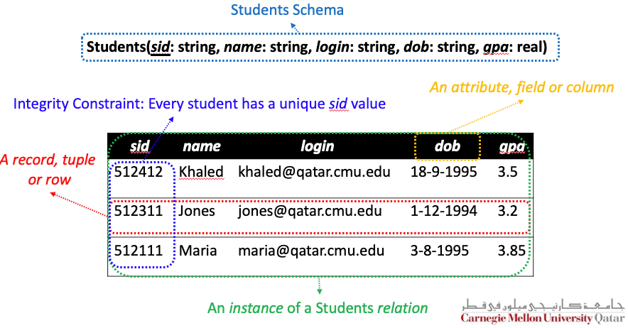
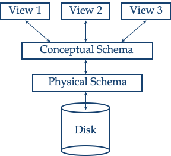
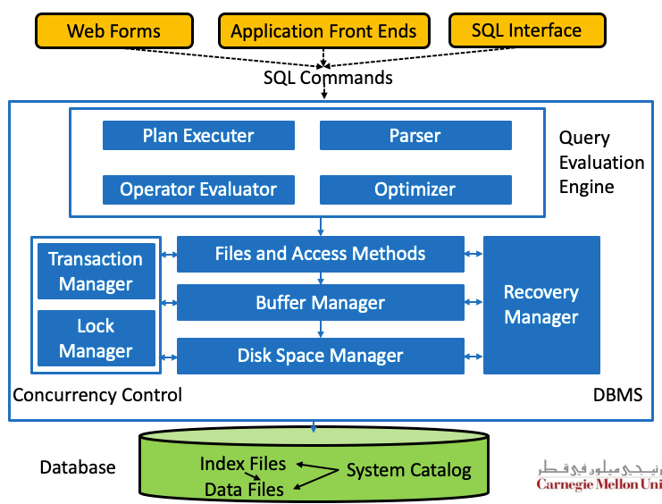
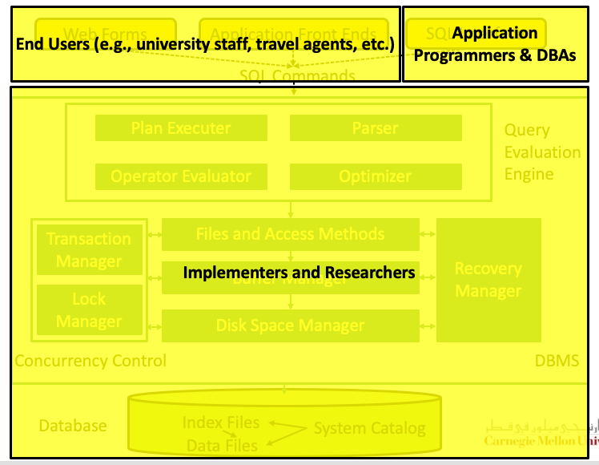

# L01 - Course Overview & Introduction to Database Applications

## Motivation

### Why Studying Database?

- data is **everywhere** and **critical**
- Data need to be recorded, maintained, accessed and manipulated *correctly*, *securely*, *efficiently* and *effectively*
- Database management systems (DBMSs) are **indispensable** software for achieving such goals
- The principles and practices of DBMSs are now an integral part of computer science curricula

## Course Overview

### List of topic

- The E-R Model
- The Relation Model
- Relational Algebra and Calculus
- SQL
- Data Storage and Organization
- Tree-Based and Hash-Based Indexing
- Query Evaluation and Optimization
- Concurrency Control and Crash Recovery
- Distributed Database, Hadoop and NoSQL and NewSQL database.

## A Primer On Databases

### Some definition

- A database is a collection of data which describes one or many real-world enterprises.
- A DBMS is a software package designed to store and 
   manage databases.
- A database system = (Big) Data + DBMS + Application Programs

### Data Model

A data model is a collection of high-level data description constructs that hide many low-level storage details

**Entity-Relationship (ER) model**

### The Relational Model

A  relation is basically a table (or a set) with rows (or records or tuples) and columns (or fields or attributes)

- Every relation has a schema, which describes the columns of a relation
- Conditions that records in a relation must satisfy can be specified

### Levels of Abstraction

- **The conceptual scheme**：data in terms of a specific data model
- **The physical scheme**：how data are stored on storage devices
- **The external schema (or views)**：data access to be customized at the level of individual user.

### Data Independence

数据独立性？简单来讲就是，在写应用时不需要考虑数据在数据库中是如何存储和组织的。

- Logical data independence
- Physical data independence

### Query in a DBMS

- Relational calculus
- Relational algebra
- Structured Query Language (SQL)

### Concurrent Execution and Transactions

提高并行访问性能

### Ensuring Atomicity

- All-or-nothing property
- 通过 log 实现（Write-Ahead Log or WAL）

### The Archit of a Relational DBMS

