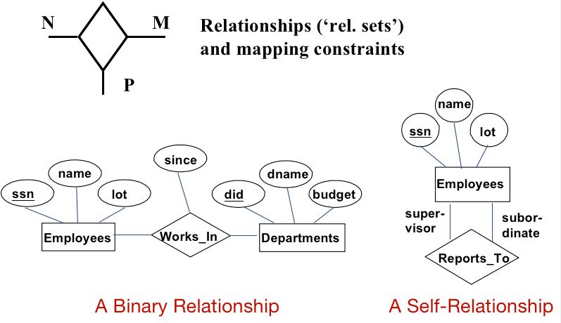

# L02 - The Entity Relationship Model

## Database Design

- Requirement Analysis
  - Users needs
- Conceptual Design
  - A high-level description of the data
- Logical Design 
  - The conversion of an ER design into a relational database schema
- Schema Refinement
- Physical Design 
  - Build indexes and clustering some tables
- Security Design 
  - Access controls

## ER Model

### Entities and Entity Sets

- Entity
  - a real-world object
  - described using a set of attributes
- Entity Set
  - a collection of similar entities
  - All entities in same entity set have the same set of attr.
  - Each entity set has a key
  - Each attribute has a domain

- Entity 用长方形标识
- Attribute 用圈标识
- primary key 用下划线标识

### Relationship and Relationship Sets

- Relationship
  - Association among two or more entities
  - Described using a set of attr.
- Relationship Set
  - Collection of similar relationship.
  - Same entity set could participate in different relationship sets, or in different "roles" in the same set
    - 一个实体集可以有多个关系集，或者在一个关系集中有不同的“role”？

### Cardinalities

- ono-to-one
- one-to-many
- many-to-many

### Participation Constraints

参与约束：某个实体集中每个实体都参与某个约束。

- total constraints (participation constraints) : thick line
- partial constraints

### Weak Entities

A weak entities can be identified uniquely only by considering the primary key of another (owner) entity.

- Owner entity set and weak entity set must participate in a one-to-many relationship set(one owner, many weak entities)
- Weak entity set must have total participation in this identifying relationship set
- Weak entities and identifying relations are drawn using thick lines

Partial key: the set of attributes of a weak entity set that uniquely identifies a weak entity for a given owner entity.

- Partial key are underline using broken lines

### ISA('is a') Hierarchies

- Entities in an entity set can sometimes be classified into subclasses
- If we declare B ISA A, every B entity is also considered to be an A entity

### Overlap and Covering Constraints

- Overlap constraints: an entity belong to both B and C
- Covering constraints: an A entity belong to neither B or C

### More details on ISA

- Attr. are inherited
- Many level of an ISA hierarchy
- Reasons for using ISA:
  - To add descriptive attr. specific to a subclass
  - To identify entities that participate in a relationship

### Aggregation

Aggregation allows indicating that a relationship set participates in another relationship set.