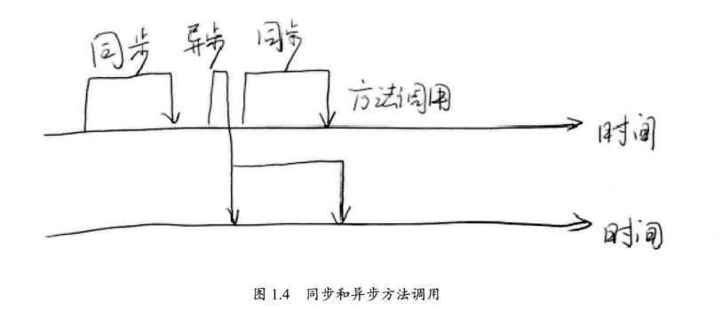
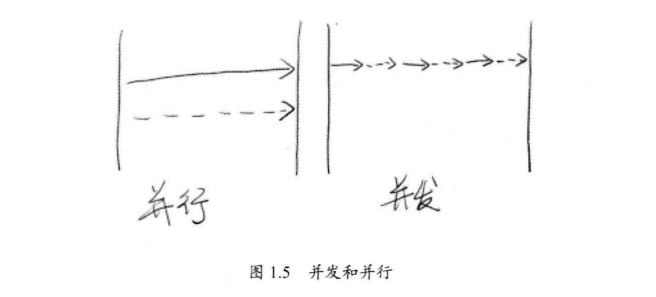
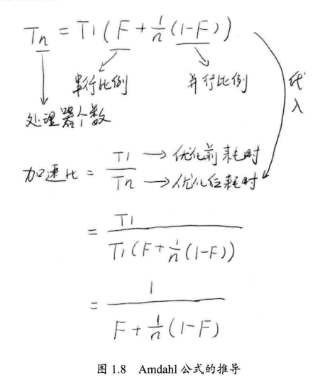
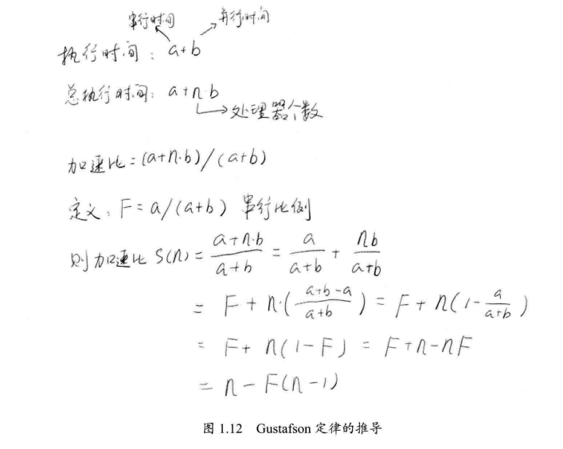

# 一些概念

## 同步与异步

- **同步**与**异步**通常用来形容一次方法调用.
- **同步**: 同步方法调用一旦开始,调用者必须**等到方法调用返回**后, 才能继续后续的操作.
- **异步**: 异步方法调用像一个消息传递, 一旦开始, 方法调用就会**立即返回,** 调用者可以继续后续的操作.



## 并发与并行

- 并发与并行都表示两个或多个任务一起执行.
- 并发偏重于多个任务交替执行, 多个任务之间可能还是串行的.
- 并行是真正意义上同时执行.
- 并发是同一时间段的一起执行, 并行是同一时刻的同时执行.



## 临界区

- 临界区用来表示一种公共资源或者说是共享数据, 可以被多个线程使用, 但每一次, 只能有一个线程使用它, 一旦临界区资源被占用, 其他线程要使用这个资源就必须等待.

## 阻塞和非阻塞

- 阻塞和非阻塞通常用来形容多线程的相互影响.

## 死锁, 饥饿和活锁:

- 死锁, 饥饿和活锁属于多线程的活跃性问题.
- 死锁:
- 饥饿是指一个或多个线程因为种种原因无法获得所需要的资源, 导致一直无法执行.
- 活锁是指多个线程互相"谦让"主动将资源释放给他人使用, 那么资源会在两个资源中不断跳动, 而没有一个线程可以同时拿到所有资源而正常执行.

## 并发级别:

- **阻塞**: 一个线程是阻塞的, 那么在其他线程释放资源之前, 当前线程无法继续执行.( 使用`synchronized`或重入锁)

- **无饥饿**: 线程调用会考虑线程之间的优先级, 即对同一个资源的分配是不公平的, 对于非公平的锁来说, 系统允许高优先级的线程插队, 那么就有可能导致低优先级的线程始终无法得到资源, 导致饥饿.

- **无障碍**: 如果两个线程是无障碍的执行, 那么他们不会因为临界区的问题导致一方被挂起. 这样就有可能出现大家一起修改共享数据, 对于无障碍的线程来说, 一旦检测到这种情况就会对自己所做的修改进行回滚, 确保数据安全. (乐观锁????). 可以依赖一个"一致性标记"来实现无障碍.无障碍的策略可能会导致所有线程不断回滚自己的操作, 而没有一个线程可以走出临界区.

- **无锁**:无锁的并行都是无障碍的, 无锁的**并发(注意是并发不是并行)**保证必然有一个线程可以在有限步内完成操作离开临界区.无锁的调用中, 一个典型的特点是会包含一个无穷循环, 这个循环中, 线程会不断地尝试修改共享变量, 如果修改成功则退出, 否则继续尝试修改:

   ```java
    while(!atomicVar.compareAndSet(localVar, localVar+1)) {
        localVal = atomicVar.get();
    } 
   ```

- 无等待: 无等待要求所以的线程都必须在有限步内完成, 这样就不会引起饥饿问题. 一种典型的无等待结构就是`RCU (Read-Copy-Update)`, 它的基本思想是, 对数据的读可以不加控制, 因此所以的读线程都是无等待, 但在写数据的时候, 先取得原始数据的副本, 接着只修改副本数据, 修改完成后, 在适合的时机写回数据.

## 两个重要的定律:

### Amdahl定律:

- **加速比**: 加速比=优化前系统耗时/优化后系统耗时

  

从Amdahl公式可以看出, N趋于无穷大时, 加速比为`1/F`, CPU数量越多, 串行化比例越低, 优化效果越好, 仅提高CPU数量而不降低程序的串行化比重, 无法提高系统性能.

### Gustafson定律



从Gustafson定律可以看出, 如果串行比例很小, 并行化比例很大, 那么加速比就是处理器个数.

## JMM(Java的内存模型) 中一些概念:

### 原子性

- 原子性是指一个操作石不可中断的. 即使是在多个线程一起执行的时候, 一个操作一旦开始, 就不会被其他线程干扰.
- 如一个全局变量`int i`, 两个线程对其赋值1和-1, 不管这两个线程以何种顺序执行, i只能是1和-1, 这就是原子性.
- 但如果是`long t`,在32位机器上(32位JVM中)可能得到结果就是不一样的了, 简单来讲就是, `t`是64位的数据, 对其进行操作需要两条指令.

### 可见性

- 可见性是指当一个线程修改了某一个共享变量的值, 其他线程是否能够立即知道这个修改.
- 外在表现为: 变量的值被改变, 但是CPU中线程依旧会读到一个旧值.
- 导致可见性问题的可能有, 缓存优化, 硬件优化, 指令重排和编译器优化

### 有序性问题

- 在并发时, 程序执行可能会出现乱序, 如写在前面的代码, 会在后面执行.
- 指令重排会导致有序性问题.
- 问题在于, 我们是无法预测, 指令是否发生重排, 如何重排.

#### 指令重排:

- **指令重排可以保证串行语义一致, 但没有义务保证多线程间语义也一致**
- 之所以要进行指令重排, 是为了减少流水线的阻塞.

#### 指令重排原则:

- 程序顺序原则: 一个线程内保证语义的串行性.
- `volatile`规则: `volatile`变量的写, 先发生于读, 保证了`volatile`变量的可见性.
- 锁规则: `unlock`必然发生在随后的`lock`前.
- 传递性: A先于B, B先于C, 则A先于C.
- 线程的`start()`方法先于它每一个动作.
- 线程的所以操作先于线程的终结`Thread.join()`
- 对象的构造函数执行, 结束先于`finalize()`方法.

