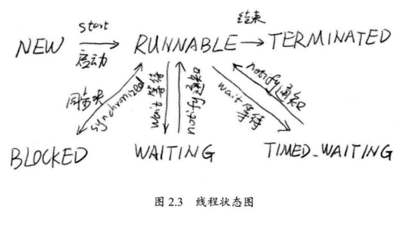

# Java并行程序基础

- 进程: 计算机中程序关于某数据集合的一次运行活动, 是系统进行资源分配和调度的基本单位.
- 线程: 轻量级进程, 是程序执行的最小单位.
- 使用多线程而不是多进程的原因: 线程间的切换, 调度和通信的成本远小于进程.

- 线程的生命周期:

  
  - `NEW`: 表示刚刚创建的线程, 这种线程还没有开始执行.
  - `RUNNABLE`: 表示线程所需的一切资源都已经准备好了.
  - `BLOCKED`: 遇到`synchronized`块会进入阻塞状态, 这时线程会暂停执行, 直到获得请求的锁.
  - `WAITING`: 等待状态(无时间限制)
  - `TIMED_WAITING`等待状态(有时间限制)
  - `TERMINATED`: 终止态.

## 初始线程

```java
Thread t1 = new Thread();
t1.start();
```

- `start()`方法会新建一个线程并让这个线程执行`run()`方法.
- 注意: 不能直接调用`run()`这样不会新建线程, 只是在当前线程中执行.
- 通常会实现`Runable`接口, 实现自己的`run()`方法, 然后通过```public Thread(Runnable target);```构造函数来初始化线程.

```java
public interface Runable {
    public abstract void run();
}
```

- `Thread`中`run()`的实现:

```java
public void run() {
    if (target != null)
        target.run();
}
```

## 终止线程

- 不要随便使用`stop()`来停止一个线程, 他会无视是否有锁.

### 线程中断

```java
public void Thread.interrupt();				// 中断线程, 会设置中断标志位
public void boolean Thread.isInterrupted(); // 判断是否被中断
public static boolean Thread.interrupted(); // 判断是否被中断, 并清除中断标志位
```

用中断实现线程退出功能:

```java
public static void main(String[] args) throws InterruptedException {

    Thread t1 = new Thread() {
        @Override
        public void run() {
            while (true) {
                if (Thread.currentThread().isInterrupted()) {
                    System.out.println("Interrupted");
                    break;
                }
                try {
                    Thread.sleep(1500);
                } catch (InterruptedException e) {
                    System.out.println("Interrupted when sleep");
                    // 因为抛出异常会清除中断标志,所以要重新设置
                    Thread.currentThread().interrupt();
                }
            }
            // yield()表示让出CPU
            Thread.yield();
        }
    };

    t1.start();
    Thread.sleep(2000);
    t1.interrupt();
}
```

**Thread.sleep()方法由于中断而抛出异常, 此时, 他会清除中断标志位.**

## 等待(wait)和通知(notify)

```java
public final void wait() throws InterruptedException  //进入object对象的等待队列
public final native void notify()					  // 随机从等待队列中唤醒一个
public final native void natifyAll()				  // 唤醒等待队列中的所有线程
```

- `wait()`方法和`notify()`方法必须包含在对应的`synchronzied`语句中, 都需要先获得目标对象的一个监视器.

`wait()`和`notify()`的Demo:

```java
package wuxiaobai24;

public class SimpleWN {
    final static Object object = new Object();
    public static class T1 extends Thread {
        @Override
        public void run() {
            synchronized (object) {
                System.out.println(System.currentTimeMillis() + ":T1 start! ");
                try {
                    System.out.println(System.currentTimeMillis() + ":T1 wait for object ");
                    object.wait();
                } catch (InterruptedException e) {
                    e.printStackTrace();
                }
                System.out.println(System.currentTimeMillis() + ":T1 end!");
            }
        }
    }

    public static class T2 extends Thread {
        public void run() {
            synchronized (object) {
                System.out.println(System.currentTimeMillis() + "T2 start! notify one thread");
                object.notify();
                System.out.println(System.currentTimeMillis() + ":T2 end!");
                try {
                    Thread.sleep(2000);
                } catch (InterruptedException e) {
                    e.printStackTrace();
                }
            }
        }
    }

    public static void main(String[] args) {
        Thread t1 = new T1();
        Thread t2 = new T2();

        t1.start();
        t2.start();
    }
}
```

输出结果为:

```
1548858388894:T1 start! 
1548858388911:T1 wait for object 
1548858388911T2 start! notify one thread
1548858388911:T2 end!
1548858390912:T1 end!
```

在T2通知T1继续执行后, T1不能立即执行, 而是必须等待T2释放object的锁, 因此要等2秒.

**`Object.wait()`和`Thread.sleep()`方法都可以让线程等待若干时间, `wait()`会释放锁, 而`sleep()`不会.**

## 挂起(suspend)和继续执行(resume)线程


