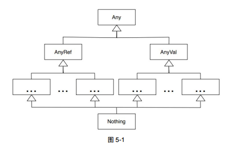

# Scala 实用指南

[Toc]

## 小试牛刀

### 探索 Scala

- Java 中的原始类型在 Scala 中被看做对象。
- Scala 是一门静态类型的编程语言，支持**类型推导**
- 句末分号是可选的
- 点号和括号也是可选的，所以可以用`s1 equals s2`代替`s1.equals(s2)`
- Scala 支持函数式编程，函数在 Scala 中是一等公民
- 关键词 val 表示不可变变量，var 表示可变变量

### 体验 Scala

- Scala 支持 REPL（read-eval-print-loop）工具。
	- `:quit` 退出
	- `：load` 加载文件
- 可以用`scala file.scala`的方式来运行 Scala 脚本
- Scala 并不强制我们实现`main()`，当我们运行 Scala 脚本时，它会自动帮我们合成一个 Main 类的JVM `main()`方法实例
- 使用 scalac 编译代码

### 从 Java 到 Scala

Scala 的循环：

```scala
for (i <- 1 to 3) {
	print(s"$i, ")
}
// 1, 2, 3
```

`<-`的左边定义了一个`val`，右边是一个生成器表达式。`1 to 3`可以理解为`1.to(3)`（因为Scala中`.`和括号都是可选的）。这里也可以用`until`来实现：

```scala
for (i <- 1 until 4) {
	print(s"$i, ")
}
// 1, 2, 3
```

我们也可以用函数式的风格来写：

```scala
(1 to 3).foreach(i => print(s"$i, "))
```


在 Scala 中，如过方法没有参数或者只有一个参数，那么可以省略点号`.`和括号，如果有多个参数，那么括号就不可省略。这种省略可以让重载操作符变得简单，或者说消除掉操作符这个概念，如`1 + 3`实际上是`1.to(3)`。当然为了保持操作符的优先级，Scala给方法或函数定义了优先级.


Scala 支持元组和多重赋值，进而实现了函数返回多个值。元祖是一个不可变的对象序列，使用下划线加数字的模式来访问元组中的元素。**元组的索引是从1开始的**

```scala
def returnMulti() = {
	("1", "2", "3")
}

val (one, two, thrid) = returnMulti()
val num = returnMulti()
print(num._1) // 1
print(num._2) // 2
```

Scala 支持变长参数，和Python有点像，通过在最后一个参数类型后面加上星号实现，而且想要将数组中的元素传入，还需要一种奇怪的数组展开标记：

```scala
def printArgs(args: Int*) = {
	println(args.getClass)
	println(args)
}
printArgs(1, 2, 3)
// class scala.collection.mutable.WrappedArray$ofInt
// WrappedArray(1, 2, 3)
val numbers = Array(1, 2, 3)
printArgs(numbers: _*)
// class scala.collection.mutable.WrappedArray$ofInt
// WrappedArray(1, 2, 3)
```

Scala 支持参数默认值，与其他语言没有太大差别，都是只能放到最后面,不过Scala还支持命名参数，所以增加了一定的灵活性：

```scala
def func(p1: Int, p2: Int = 2, p3: Int = 3) = {}
func(1)
func(1, 2)
func(1, 2, 3)
func(1, p2 = 2)
func(1, p3 = 3)
func(p1 = 1)
```

Scala 还支持一种比较奇怪的参数形式——隐式参数，和默认参数有点类型，但是这个默认值是在调用者的上下文中设置的。函数的定义者需要先把参数标记为`implicit`（这种情况下要放到一个单独的参数列表中，Scala支持多参数列表）。然后如果调用时没有传参的话，Scala会在调用者的作用域中寻找一个隐式变量，这时区分不同的隐式参数是通过类型区分的，所以一个作用域中每种类型最多只有一个隐式变量。

```scala
class Op(name: String) {}
def func(p1: Int, p2: Int)(implict op: Op) {}

implict def defaultOp = new Op("Add")
func(1, 2)
func(1, 2)(defaultOp)
```

Scala 中的字符串就是 java.lang.String，所以我们可以直接用 Java 的方式使用。同时利用 String 到 scala.runtime.RichSrting 的隐式转化。Scala 还给字符串添加了一下其他功能。

```scala
s = "hello\nhello"
println(s.catalize)
// Hello
// Hello
println(s.lines.foreach(line => println(line.reverse)))
// olleh
// olleh
```

同时 Scala 支持多行字符串：

```scala
val str = """hello
	hello
"""
println(str)
// hello
// 		hello
val str2 = """hello
	|hello
"""
println(str.stripMargin)
// hello
// hello
```

Scala 使用 s 插值器可以替换字符串中形如`$str`或者`${value + 1}`表达式，使用 f 插值器可以进行字符串的格式化：

```scala
val value = 1.2345
println(s"${value}")
// 1.2345
println(f"${value}%2.2f")
// 1.23
```

Scala 中的一些约定or特性：

- 支持脚本
- return 和 分号 是可选的
- 类和方法默认是public的
- Scala 不强制要求捕获异常
- 括号和点好是可选的
- Scala 按照顺序导入 java.lang，scala，scala.Predef 包

Scala 方法优先级（从低到高）：

- 所有字符
- |
- ^
- &
- < >
- = !
- :
- + -
- * / %
- 其他特殊字符

一些奇怪的特性：

- Scala 中赋值操作结果为 Unit，Unit 在 Scala 中相当于 void
- Scala 中的`==`都是基于值的比较（会调用`equals`函数），如果要做基于身份或地址的比较的话，可以使用`eq`方法。

Scala 的访问控制：

- Scala 默认 public
- Scala 中的 protected 表示只有派生类能够访问，同时在派生类访问 protect 成员时，成员类的类型也需要一致。

```scala
class Vehicle {
	protected def checkEngine {}
}

class Car extends Vehicle {
	def start() { checkEngine() }
	def tow(car: Car) {
		car.checkEngine()
	}
	def tow(vehicle: Vehicle) {
		vehicle.checkEngine() // 编译错误
	}
}
```

Scala 还可以给 private 和 protected 指定额外的参数，形如`private[AccessQualifier]`

- 没有指定 AccessQualifier，只有当前类或者伴生对象中可以访问
- AccessQualifier 为类名，则可以在该类和其伴生对象中访问
- AccessQualifier 为包名，则可以在该包类访问
- AccessQualifier 为 this，则限定只能在该实例中访问，对于其同一个类的其他实例，也是不可见的，这是所有选项中限制最严格的。

Scala 中可以定义嵌套包。

```scala
package p1 {
	package p2 {}
	package p3 {}
}
```

### 处理对象

Scala 中创建对象的方法与 Java 类似：

```scala
val sb = new StringBuilder("hello")
val sb2 = new StringBuilder()
// or 
val sb3 = new StringBuilder
```

Scala 用一种很奇怪的语法来定义类、构造器和属性，有点像是函数的感觉：

```scala
class Car(val year: Int, var milesDriven: Int) {
    private var privateVal: Int = 0;
}
```

我们可以使用如下命令对 Scala 代码进行编译，并查看其在 Java 中对于的类：

```bash
scalac Car.scala
javap -private Car
```

得到的输出为：

```java
Compiled from "Car.scala"
public class Car {
  private final int year;
  private int milesDriven;
  private int privateVar;
  public int year();
  public int milesDriven();
  public void milesDriven_$eq(int);
  private int privateVar();
  private void privateVar_$eq(int);
  public Car(int, int);
}

```

可以看到用`val`定义的`year`是用`final`修饰的，即不可变，而且只有 getter（`year()`），而`var`定义的`milesDriven`是可变的，它既有 setter（`milesDriven_$eq`），也有 getter。而且即使是类内部中定义的变量，他也会生对应的 setter 和 getter，同时它还生成了一个构造器，其参数类型是由`year`和`milesDriven`的类型相同的，所以某种意义上，我们在定义`class`的时候和定义函数是一样的，例如在类内部调用`println`，在`new Car(1, 2)`时，就会调用这个`println`：

```scala
class Car(val year: Int, var milesDriven: Int) {
    private var privateVal: Int = 0;
    println("hello")
}
new Car(1, 2)
// hello
```

这里自动生成的修改器和访问器是不符合 JavaBean 的规范的，我们可以用注解的方式生成符合 JavaBean 规范的类，以便于被 Java 代码使用，**BeanProperty 注解只能修饰non-private属性**：

```scala
import scala.beans.BeanProperty;

class Car(@BeanProperty val year: Int, var milesDriven: Int) {
  // @BeanProperty private var privateVar: Int = 0
  @BeanProperty var publicVar: Int = 0
}
```

生成的代码如下：

```java
Compiled from "Car.scala"
public class Car {
  private final int year;
  private int milesDriven;
  private int publicVar;
  public int year();
  public int milesDriven();
  public void milesDriven_$eq(int);
  public int publicVar();
  public void publicVar_$eq(int);
  public int getPublicVar();
  public int getYear();
  public void setPublicVar(int);
  public Car(int, int);
}
```

这时就有了符合 JavaBean 的 getter 和 setter 了。

除了自动生成的主构造器外，我们还可以用名为`this`的方法定义辅助构造器，**辅助构造器的第一行有效语句必须调用主构造器或者其他辅助构造器**。同时，我们还可以为该类定义其方法：

```scala
class Car(val year: Int, var milesDriven: Int) {
    private var privateVal: Int = _;
    
    def this(year: Int, milesDriven: Int, parameter3: Int) {
        this(year, milesDriven);
        privateVal = parameter3
    }
    def hello: Unit {
        println("hello world")
    }
    override def toString: String = {
        s"$year $milesDriven $privateVal"
    }
}
```

- Scala 要求变量在使用前必须初始化，所以在 Class 内部进行属性定义的时候，必须初始化。
- Scala 中可以用下划线`_`来初始化变量，其表示对应类型的默认值。

给类型取别名的方式：

```scala
class ClassName(val parameter1: Int)
type NewClassName = ClassName
```

在 Scala 中继承（extends）某个类时，与 Java 类似，只是多了两个限制：

- 当我们要重载某个方法时，必须使用`override`对方法进行修饰。
- 只有主构造器能传递参数给基类构造器

```scala
class Vehicle(val id: Int, val year: Int) {
    override def toString: String = s"ID: $id Year: $year"
}

class Car(override val id: Int, override val year: Int, val fuelLevel: Int)
  extends Vehicle(id, year) {
    override def toString: String = s"${super.toString} Fuel Level: $fuelLevel"
}
```

主要到在 Car 中属性 id 和 year 是继承于 Vehicle 的属性，所以我们用 `override` 来标明，使得其不会为这两个属性生成字段和方法。

Scala 的参数化类型（泛型）通过记号`[T]`来告诉编译器：

```scala
def echo[T](input1: T, input2: T): Unit = 
	println(s"$input1 and $input2")
echo(1, 2) // 1 and 2
echo("hello", "world") // hello and world
echo(1, "string") // 1 and string
echo[Int](1, 2) // 1 and 2
```

由于 Scala 中所有类型都派生自`Any`，所以`echo(1, “string”)`是可以通过的，为了防止不混用类型，建议这样使用`echo[Int](1, 2)`。

```scala
class Message[T](val content: T) {
    override def toString: s"Message is $content"
    
    def is(value: T): Boolean = value == content
}
val message1: Message[String] = new Message("howdy")
val message2 = new Message(43)
message1.is("howdy")
message2.is(12)
// message1.is(12) // error
```

Scala 使用伴生对象来实现单例对象和`static`，所谓的伴生对象就是一个关联到一个类的对象，这个对象的名字与这个类相同，我们分别将其成为 伴生对象 和 伴生类。那些没有任何类与其管理的对象就被称为 独立对象。

伴生对象和伴生类有很重要的特性：

- **伴生类与伴生对象之间没有边界，它们可以相互访问私有字段和方法**。
- 每个类都可以有伴生对象，通常它们放在同一个文件中

```scala
import scala.collection._ // 表示导入 collection 包下的所有变量/名字

// 将 Marker 的主构造器声明为 private，这时只有伴生对象可以访问
class Marker private (val color: String) {  
    println(s"Creating ${this}")

    override def toString: String = s"marker color $color"
}

object Marker {
    private val markers = mutable.Map(
        "red" -> new Marker("red"),
        "blue" -> new Marker("blue"),
        "yellow" -> new Marker("yellow")
    )
	
    // 相当于 Marker 类的 static 方法
    def supportedColors: Iterable[String] = markers.keys 
    
    def getMarker(color: String): Marker =
    markers.getOrElseUpdate(color, new Marker(color))
}
```

在 Scala 中，枚举是一个扩展了`Enumeration`类的对象：

```scala
object NumberEnum extends Enumeration {
    type NumberEnum = Value
    val One, Two, Thrid = Value
}
```

Value 只有在枚举中能访问，`type NumberEnum = Value`是给`Value`类取了一个别名`NumberEnum`，因此这时候有一个类`NumberEnum`以及它的伴生对象`NumberEnum`

在 Scala 中，包（package）中可以有变量和函数，他们被放在一个叫包对象的单例中：

```scala
package object packageName {
   	def func = "hello world"
    val hello = "hello world"
}
```

它的作用有点像是 Python 中的`__init__.py`？

### 善用类型

Scala 是一门静态类型语言，但它偏向于使用类型推到，在大部分情况下，我们不需要提及类型。Scala 中类型放在变量名后面且类型是可选的。

```scala
var greet1: String = "Ahoy"
var greet2 = "Ahoy"
```

在以下几种情况下，必须要显式地指定类型：

- 当定义没有初始值的类字段时
- 当定义函数或方法的参数时
- 当定义函数或方法的返回类型，仅当我们使用显式的`return`语句或使用递归时
- 当将变量定义为另一种类型，而不是被直接推断出类型时



在 Scala 中 `Any`类型是所有类型的超类，`AnyVal`和`AnyRef`是其直接子类，`Anyway`是 Scala 中所有值类型的基础 类型，并映射到 Java 中的原始类型，而 `AnyRef`是所有引用类型的类型，其包含了 Java 中`Object`的方法。

`Nothing`是所有类型的子类，它使得类型推断过程得以顺利进行，如：

```scala
def someOp(number: Int) = 
	if (number < 10)
		number * 2
	else
		throw new RuntimeException("invalid argument")
```

因为运行到`throw new Runt…`时，函数返回的是`Nothing`，而`Nothing`是所有类型的子类，所以最终`someOp`的返回值会被推断成`Int`。

除了抛出异常的情况，我们的函数还可以用`Option[T]`来表明不打算返回结果（返回值不存在）：

```scala
def commentOnPractice(input: String) = {
    if (input == "test") Some("good") else None
}
for (input <- Set("test", "hack")) {
    val comment = commentOnPractice(input)
    val commentDisplay = comment.getOrElse("Found no comments")
    println(s"input: $input comment: $commentDisplay")
}
```

在上面的例子中，`commentOnPractice`的会返回`Some[T]`或者`None`，又因为它们都继承与`Option[T]`，所以函数的返回值被推断为`Option[String]`，我们可以使用`getOrElse`来进行防御性取值。

除了返回值可能会不存在的情况，我们可能会遇到希望返回两种类型的情况，这时我们可以使用`Either`来实现，`Either`可以让我们返回两种类型的值，即左值`Left`和右值`Right`，通常左值被认为是错误，而右值通常被认为是正确的值：

```scala
def compute(input: Int) =
    if (input > 0)
      Right(math.sqrt(input))
    else
      Left("Error computing, invalid input")

def displayResult(result: Either[String, Double]): Unit = {
    println(s"Raw: $result")
    result match {
        case Right(value) => println(s"result $value")
        case Left(err) => println(s"Error: $err")
    }
}

displayResult(compute(4))
displayResult(compute(-4))
```

Scala 对函数或方法的返回值类型的推断需要`=`来触发，即只有使用`=`将方法的声明和方法的主体分开时，Scala 才会进行返回值推断，否则其会将返回值视为`Unit`：

```scala
def function1 { Math.sqrt(4) } // 返回值为 Unit
def function2 = { Math.sqrt(4) } // 返回值为 Double
def function3 = Math.sqrt(4) // 返回值为 Double
def function4: Double = { Math.sqrt(4) } // 返回值为 Double
```

**在函数声明和主体之间使用`=`是惯用风格**

是否应该使用`()`：

- 如果方法只是字段或属性的访问器，那么不要将`()`放置带定义中，**这时调用时也不能用`()`**
- 如果方法只是执行一些计算并返回结果，也去掉`()`
- 如果一个函数有副作用，那么在声明和调用时都使用`()`
- 任何返回为`Unit`的方法都必须产生副作用，因此么在声明和调用时都使用`()`

对于内部 API，最好让 Scala 推断函数和方法的返回值，而对于外部 API，则显式指定类型。

Scala 还提供了针对泛型集合的类型推断：

```scala
import java._
var list1 = new util.ArrayList[Int]
var list2 = new util.ArrayList
var list3 = new util.ArrayList[Any]

list2 = list1 //error
list3 = list1 // error
```

上面的例子中，`list2`会被推断成`ArrayList[Nothing]`的类型，由于**Scala 强制赋值符号两边的集合类型是相同**，所以将`list1`赋值给`list2`和`list3`都是不被允许的，但是我们可以通过协变和逆变来规避掉。

```scala
class Pet(val name: String) {
    override def toString: String = name
}

class Dog(override val name: String) extends Pet(name)

// 协变
def workWithPets[T <: Pet](pets: Array[T]): Unit = {
    //...
}

val dogs = Array(new Dog("Rover"), new Dog("Comment"))
workWithPets(dogs)

// 逆变
def copyPets[S, D >: S](fromPets: Array[S], toPets: Array[D]): Unit = {
	// ...
}

val pets = new Array[Pet](10)
copyPets(dogs, pets)

class MyList[+T]
var list1 = new MyList[Int]
var list2: MyList[Any] = _
list2 = list1

class MyList2[-T]
var list3 = new MyList[Int]
var list4 = new MyList // var list4: MyList[Nothing] = _
list4 = list3
```

- **协变**：使得一个接收**基类**实例集合的地方，能够用一个**子类**实例的集合
  - `T <: Pet`表示`T`为`Pet`的子类
  - 用`+T`标记可以让集合支持接收子类实例的集合
- **逆变**：使得一个接收**子类**实例集合的地方，能够用一个**基类**实例的集合
  - `D >: S`表示`D`为`S`的基类
  - 用`-T`标记可以让集合支持接收基类实例的集合

Scala 可以通过隐式函数和隐式类两种方式来实现类型转换。

使用隐式转换函数，需要先导入`Scala.language.implicit.Conversions`，并将隐式转换函数标记为`implicit`，当当前作用域中存在这个函数（使用`import`导入或者存在在当前文件中），那么`Scala`会自动使用该函数：

```scala
class DateHelper(offset: Int) {
  def days(when: String): LocalDate = {
    var today = LocalDate.now
    when match {
      case "age" => today.minusDays(offset)
      case "from_now" => today.plusDays(offset)
      case _ => today
    }
  }


}

object DateHelper {
  var ago = "ago"
  var from_now = "from_now"

  implicit def convertInt2DateHelper(offset: Int): DateHelper = new DateHelper(offset)
}

val past = 2 days ago
val appointment = 5 days from_now
```

在上面的例子中，2 和 5 都会被 Scala 自动调用隐式转换函数`converInt2DataHelper`转换为`DateHelper`，然后由于 Scala 中可以省略点号和括号，所以`2 days ago`相当于`converInt2DateHelper(2).days(ago)`。

当存在多个隐式转换，Scala 会选择最适合的那个，同时，**Scala 一次最多只能应用一个隐式转换**。

我们可以用`implict`标记一个类成为隐式类，隐式类唯一的目的就是适配器或转换器，**隐式类不能是一个独立的类，它必须要在一个单例对象、类或特质中**。

```scala
object DateUtil {
  val ago = "ago"
  val from_now = "from_now"
  implicit class DateHelper(val offset: Int) {
    import java.time.LocalDate

    def days(when: String): LocalDate = {
      val today = LocalDate.now
      when match {
        case "age" => today.minusDays(offset)
        case "from_now" => today.plusDays(offset)
        case _ => today
      }
    }
  }
}

val past = 2 days ago
val appointment = 5 days from_now
```

为了提供流利性、易用性并使用领域特定方法对现有类进行扩展，我们**更倾向于使用隐式类**。

在上面隐式类的实现中，我们每次使用`2 days ago`都会创建一个`DateHelper`，而这个对象的生命周期又很短，所以频繁使用隐式转换会导致大量的短生命周期的垃圾对象，为了解决这个问题，我们可以通过值对象来解决这个问题，我们只需要用继承`AnyVal`即可，即`implicit class DateHelper(val offset: Int) extends AnyVal`。值类可以在任何简单值或原始值就够用的情况下，消除不必要的对象创建。

我们可以用隐式类型转换来实现插值器：

首先，`interpolatorName“text1 $expr1 text2 $expr2`会被转换为`new StringContext("text1", "text2", "").interpolatorName(expr1, expr2)`。所以我们可以用隐式类型转换来给`StringContext`添加新的方法`interpolatorName`，这样就能实现插值器了，下面的代码中，我们实现了`mask`插值器：

```scala
object MyInterpolator {

  implicit class Interpolator(val context: StringContext) extends AnyVal {
    def mask(args: Any*): StringBuilder = {
      val processed = context.parts.zip(args).map { item =>
        val (text, expression) = item
        if (text.endsWith("^"))
          s"${text.split('^')(0)}$expression"
        else
          s"$text...${expression.toString takeRight 4}"
      }.mkString
      new StringBuilder(processed).append(context.parts.last)
    }
  }

}
  val ssn = "123-45-6789"
  val account = "0246781263"
  val balance = 2014.23

  println(
    mask"""Account: $account
           |Social Security Number: $ssn
           |Balance: $$^$balance
           |Thanks for you business.
      """.stripMargin)
// Account: ...1263
// Social Security Number: ...6789
// Balance: $2014.23
// Thanks for you business.
```


